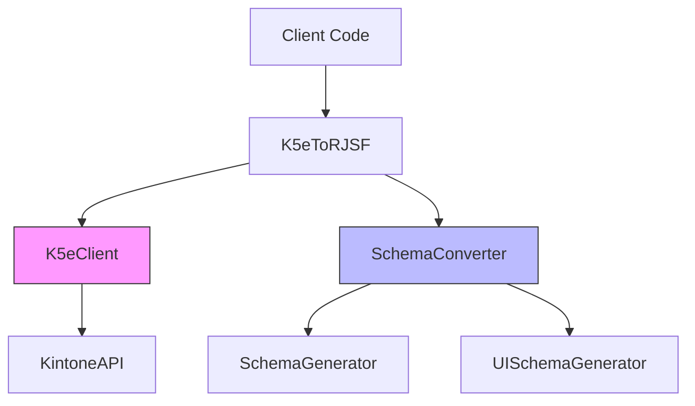
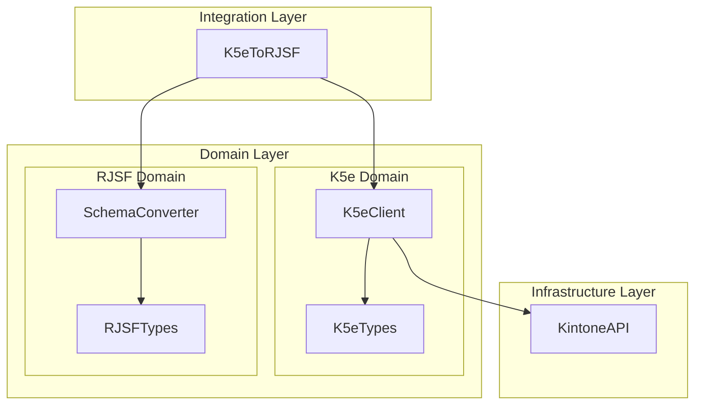
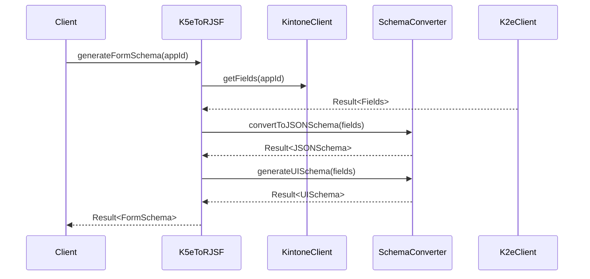

# アーキテクチャ概要

## コンポーネント図

```mermaid
graph TD
    A[Client Code] --> B[K5eToRJSF]
    B --> C[K5eClient]
    B --> D[SchemaConverter]
    C --> E[KintoneAPI]
    D --> F[SchemaGenerator]
    D --> G[UISchemaGenerator]

    style C fill:#f9f,stroke:#333
    style D fill:#bbf,stroke:#333
```

## レイヤー構成

```mermaid
graph TB
    subgraph Integration Layer
        K5eToRJSF
    end
    
    subgraph Domain Layer
        subgraph K5e Domain
            K5eClient
            K5eTypes
        end
        
        subgraph RJSF Domain
            SchemaConverter
            RJSFTypes
        end
    end
    
    subgraph Infrastructure Layer
        KintoneAPI
    end
    
    K5eToRJSF --> K5eClient
    K5eToRJSF --> SchemaConverter
    K5eClient --> KintoneAPI
    K5eClient --> K5eTypes
    SchemaConverter --> RJSFTypes
```

## データフロー

```mermaid
sequenceDiagram
    participant Client
    participant K5eToRJSF
    participant KintoneClient
    participant SchemaConverter
    
    Client->>K5eToRJSF: generateFormSchema(appId)
    K5eToRJSF->>KintoneClient: getFields(appId)
    K2eClient-->>K5eToRJSF: Result<Fields>
    K5eToRJSF->>SchemaConverter: convertToJSONSchema(fields)
    SchemaConverter-->>K5eToRJSF: Result<JSONSchema>
    K5eToRJSF->>SchemaConverter: generateUISchema(fields)
    SchemaConverter-->>K5eToRJSF: Result<UISchema>
    K5eToRJSF-->>Client: Result<FormSchema>
```
